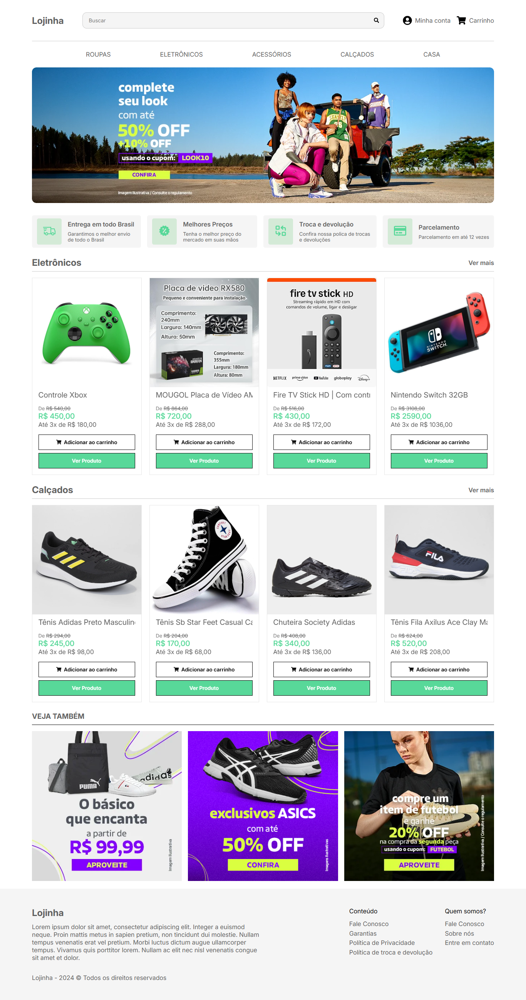

O projeto consiste em uma loja, como funcionalidades como login/cadastro de usuário, carrinho e painel do administrador para gerenciar os produtos

#### HOME


#### Admin page


### Inicializando projeto

Navegue até a parta "client" e execute o comando

```bash
npm install
```

*Faça o mesmo na pasta "backend"

### Executando projeto

Para executar tando o backend quanto o front end usamos o comando

```bash
npm run dev
```

### .env client
Crie o arquivo .env na pasta "client" seguindo o modelo abaixo

```bash
VITE_FIREBASE_API_KEY = "SUA CHAVE DE API DO FIREBASE"
VITE_BACKEND_BASE_URL = "A URL PADRÂO DO SEU BACKEND (http://localhost:8000)"
```

### .env backend
Crie o arquivo .env na pasta "backend" seguindo o modelo abaixo

```bash
AWS_ACCESS_KEY_ID="SEU ID DE ACESSO" 
AWS_SECRET_ACCESS_KEY="SUA CHAVE DE ACESSO"
AWS_REGION="REGIÃO DO SEU AWS S3"
AWS_BUCKET_NAME="NOME DO SEU BUCKET"

Mercado_Pago_Access_Token="ACCESS TOKEN DO MERCADO PAGO"
```

AS variavéis com AWS são para se conectar ao seu "AWS S3" que no projeto é usado para armazenar as imagens dos produtos.

Já o token do mercado pago é para que seja possivel aceitar pagamentos

### Edite o arquivo Firebase.js 
Edite o arquivo Firebase.js dentro de client com as informações do seu firebase

```bash
const firebaseConfig = {
  apiKey: import.meta.env.VITE_FIREBASE_API_KEY,
  authDomain: "SEU DOMINIO DO FIREBASE",
  projectId: "SEU PROJECT ID",
  storageBucket: "SEU BUCKET",
  messagingSenderId: "SUAS INFORMAÇÕES",
  appId: "SEU API ID",
  measurementId: "SUAS INFORMAÇÕES"
};
```
O Firebase é usado no projeto para permitir login usando a conta do google

### serviceAccountKey.json
No firebase gere uma nova chave privada e salve esse arquivo como "serviceAccountKey.json" dentro da raiz da pasta backend


